# ChatRoom-Projet-SR03

## Aperçu du Projet

Ce projet est une application full-stack basée sur Spring Boot et React, incluant des pages d'administration et des pages de chat, utilisant WebSocket pour la communication en temps réel.

## Table des Matières

1. [Description de l'Architecture](#description-de-larchitecture)
2. [Conception](#conception)
3. [Explications sur les Interactions Technologiques](#explications-sur-les-interactions-technologiques)
4. [Résultat Eco-Index et Améliorations](#résultat-eco-index-et-améliorations)
5. [Instructions d'Utilisation](#Instructions-dUtilisation)

## Description de l'Architecture
### Schéma d'Architecture

### Description de l'Architecture

- **Utilisateur (Utilisateur)** : L'utilisateur interagit avec le client via un navigateur web.
- **Client (React, HTMLs/Thymeleaf + CSS + JS(Bootstrap))** : La partie frontend, construite avec deux partie: Page d'Administration et Page de Chat.
- **Serveur (Spring Boot)** : La partie backend, utilisant Spring Boot pour gérer la logique métier et les requêtes API.
- **Base de Données (MySQL)** : La partie base de données, utilisant MySQL pour stocker et récupérer les données.

## Conception

### Diagramme de Classes

### Justification des Choix
- **Classe User** : Cette classe est conçue pour gérer les informations de base des utilisateurs et leur rôle dans le système.
- **Classe ChatRoom** : Cette classe est conçue pour gérer les informations des salles de chat, y compris leur création et leur gestion par les utilisateurs.
- **Relations** :
  - **Création de ChatRoom** : Un utilisateur (`User`) peut créer plusieurs salles de chat (`ChatRoom`), ce qui représente une relation un-à-plusieurs.
  - **Participation à ChatRoom** : Un utilisateur (`User`) peut participer à plusieurs salles de chat (`ChatRoom`) et une salle de chat peut avoir plusieurs utilisateurs, ce qui représente une relation plusieurs-à-plusieurs.
## Explications sur les Interactions Technologiques

### Interactions entre React, Spring et WebSocket

- **React** : Utilisé comme framework frontend pour construire l'interface utilisateur Chat, gérer les interactions utilisateur et envoyer des requêtes au backend.
- **Spring Boot** : Utilisé comme framework backend pour gérer la logique métier, le stockage des données et les requêtes API. Les contrôleurs Spring Boot reçoivent les requêtes du frontend et renvoient les données appropriées.
- **WebSocket** : Utilisé pour établir une connexion persistante entre le client et le serveur, permettant la communication en temps réel. Principalement utilisé pour la fonctionnalité de chat, permettant aux utilisateurs d'envoyer et de recevoir des messages instantanément.

Flux d'interaction :

1. L'utilisateur effectue des actions sur le frontend React, telles que la connexion, la planification de chat et l'envoi de messages dans chat.
2. Le frontend React communique avec le backend Spring Boot via des APIs pour obtenir ou stocker des données.
3. Pendant le chat, le frontend utilise WebSocket pour établir une connexion en temps réel avec le backend.
4. Spring Boot traite les messages WebSocket, diffuse les messages aux autres clients connectés.

## Résultat Eco-Index et Améliorations

### Résultat Eco-Index

Nous avons utilisé le plugin GreenIT Analysis pour évaluer l'index écologique de notre site. Voici les résultats :
- **EcoIndex** : 86.29/100
- **Water Consumption**: 1.91(cl)
- **Greenhouse Gases Emission(gCO2e)** : 1.27
- **Request number** : 2
- **Page Size** :0(KB)
- **Dom Size** : 286

Notre page web a obtenu de très bons résultats dans l'évaluation GreenIT Analysis, mais cela pourrait être lié à la simplicité de notre page.
Les principaux indicateurs montrent une excellente performance environnementale :
- Le score EcoIndex est élevé, indiquant que la page est respectueuse de l'environnement.
- La consommation d'eau et les émissions de gaz à effet de serre sont toutes deux faibles, ce qui montre une utilisation efficace des ressources et une faible empreinte carbone.
- Le nombre de requêtes et le nombre d'éléments DOM sont très faibles, ce qui indique un chargement rapide de la page et une structure simplifiée.

### Idées d'Amélioration

1. **Optimisation de l'interface utilisateur (UI)** :
- **Améliorer l'esthétique** : Utiliser des bibliothèques de composants React pour un design plus moderne et attractif.

2. **Optimisation de l'utilisation des API** :
- **Réutiliser les mêmes API** : Regrouper les points de terminaison API similaires pour réduire les appels redondants et améliorer l'efficacité.
- **Améliorer la gestion des erreurs** : Implémenter une gestion d'erreurs centralisée dans React pour réduire les appels API inutiles et améliorer la robustesse de l'application.
- **Utiliser des mécanismes de mise en cache** : Utiliser des mécanismes de mise en cache comme le cache du navigateur et le cache côté serveur pour réduire les appels API redondants.

3. **Optimisation du code** :
- **Réduire les duplications de code** : Créer des composants React et des classes Java réutilisables pour éviter la répétition du code.
- **Ajouter plus des commentaires** : Ajouter plus des commentaires clairs et concis dans le code pour expliquer la logique et les décisions importantes. Cela aidera les autres développeurs à comprendre et à maintenir le projet plus facilement.

4. **Synchronisation entre le frontend et le backend** :
- Dans la fenêtre de Chat, l'affichage de la liste (`Online Users`) des utilisateurs connectés dans le Chat a le problème de synchronisation quand un utilisateur quitte le Chat.
## Instructions d'Utilisation

### Lacement de l'application
Pour lancer l'application, vous devez exécuter le backend Spring Boot et le frontend React séparément.
### Connexion (Login)
Pour Login, il faut utiliser l'url suivant: `localhost:3000`

Après être entré sur l'écran de connexion, vous devez entrer l'e-mail déjà enregistré dans la base de données et le mot de passe correspondant pour vous connecter. 
Si l'e-mail entré n'est pas enregistré dans la base de données, une erreur correspondante sera signalée ; 
si le mot de passe entré ne respecte pas les exigences "majuscules et minuscules, caractères spéciaux, longueur du mot de passe supérieure ou égale à 8", une erreur sera également signalée, 
mais ces deux types d'erreurs ne sont pas comptés dans le nombre d'erreurs nécessaires pour verrouiller le compte ; 
si l'e-mail est correctement entré, le format du mot de passe est correct, mais le mot de passe est incorrect trois fois, alors le compte sera verrouillé.

[//]: # (![login.png]&#40;Readme_picture%2Flogin%2Flogin.png&#41;)

    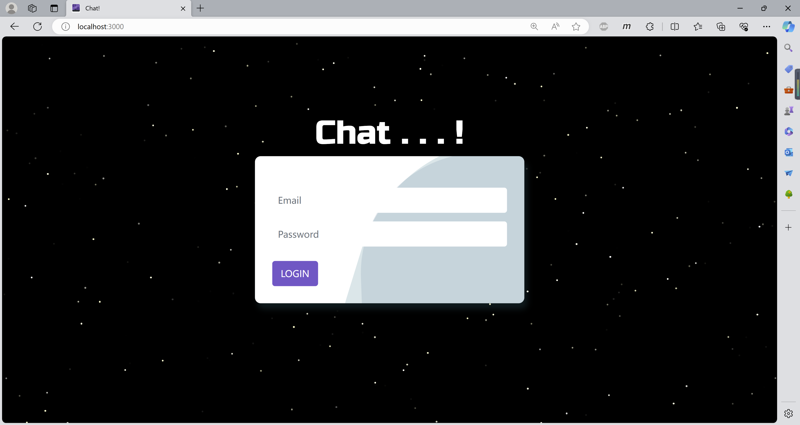

    
    
    
    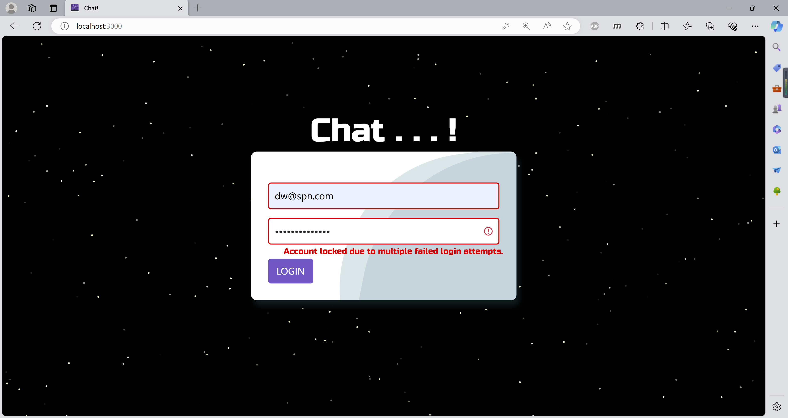

### Accueil
Après la connexion, vous serez redirigé vers la page d'accueil comme illustré ci-dessous. 
Si vous êtes un utilisateur normal, vous ne pouvez pas accéder à la page d'administration;
sinon, vous pouvez accéder à la page d'administration par cliquer sur le lien "Go to Admin Page".

    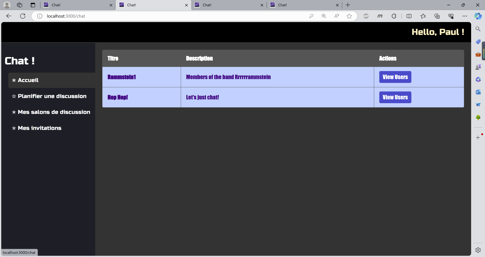
    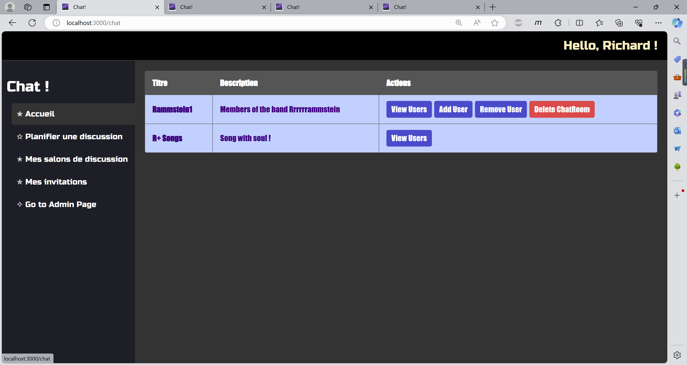

Dans la partie "Content" de l'Accueil, 
les Chat Rooms créées par l'utilisateur actuel ainsi que celles auxquelles il a été invité à rejoindre seront affichées.

### Mes salons de discussion
Dans la page "Mes salons de discussion", vous pouvez voir les salons de discussion que vous avez créés. 
La forme de l'affichage des informations est la même que celle de la page d'accueil.

    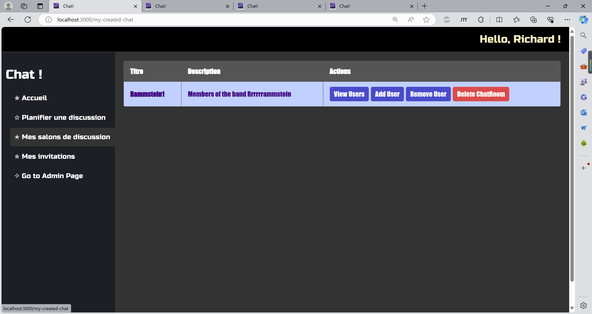

### Mes invitations
Dans la page "Mes salons de discussion", vous pouvez voir les salons de discussion que vous avez été invité à rejoindre.
La forme de l'affichage des informations est la même que celle de la page d'accueil.

    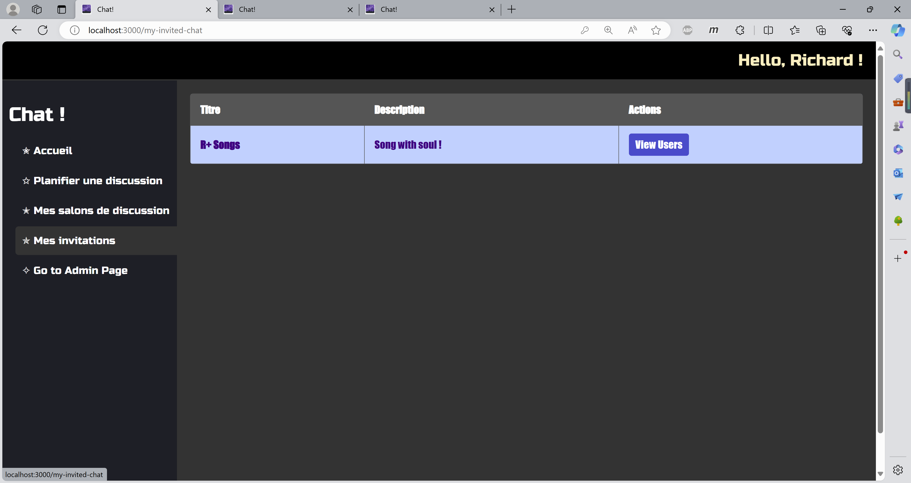

### Chat Room

En cliquant sur le titre du Chat Room, vous pouvez entrer dans la salle de chat comme indiqué ci-dessous. 
Comme le montrent les images, la zone de dialogue est à gauche, et les utilisateurs actuellement dans la salle de chat sont affichés à droite.

    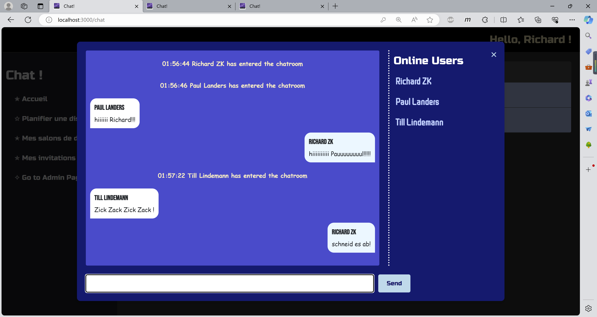
    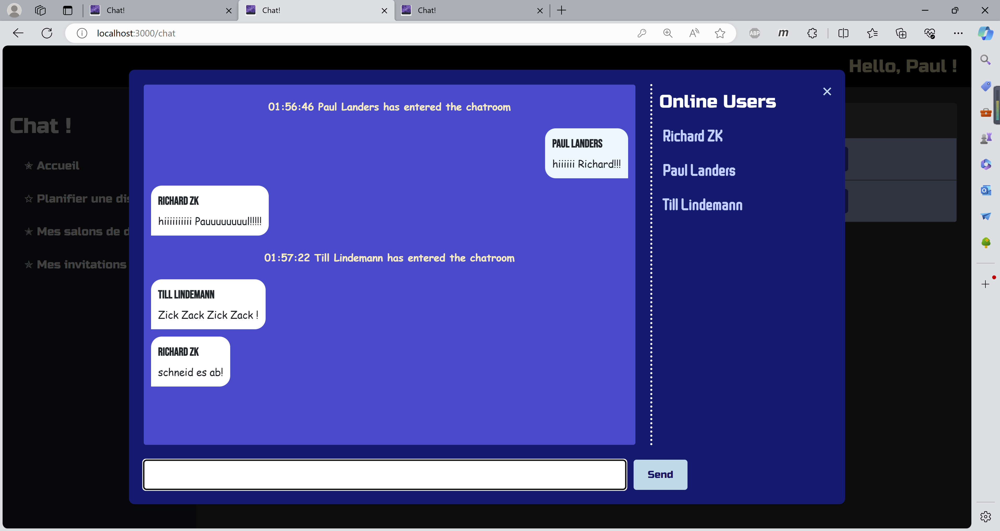
    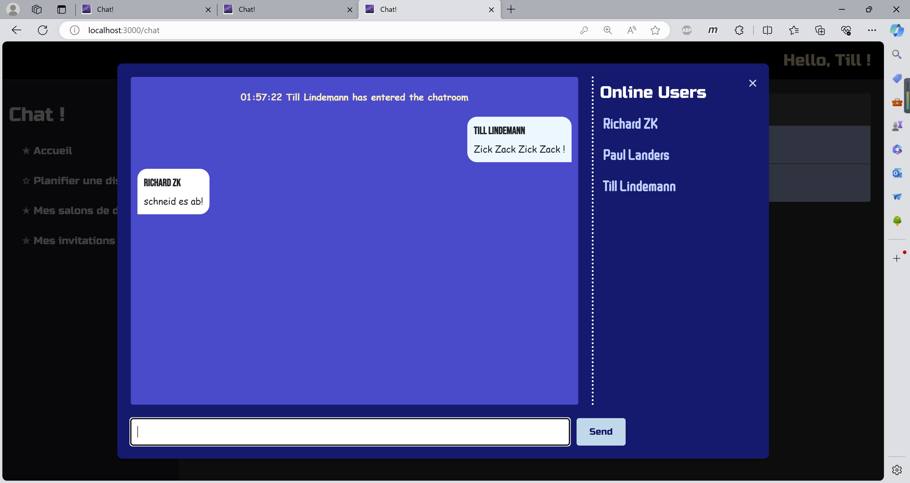

### Planifier une discussion
Dans la page "Planifier une discussion", 
vous pouvez créer un nouveau Chat Room
* en entrant le nom du Chat Room
* en entrant une description du Chat Room
* en entrant le start time et une "duration"
* et en sélectionnant les utilisateurs à inviter.

Après avoir cliqué sur le bouton `Create` pour terminer la création, la page sera automatiquement redirigée vers la page 'Accueil' après une courte attente.

    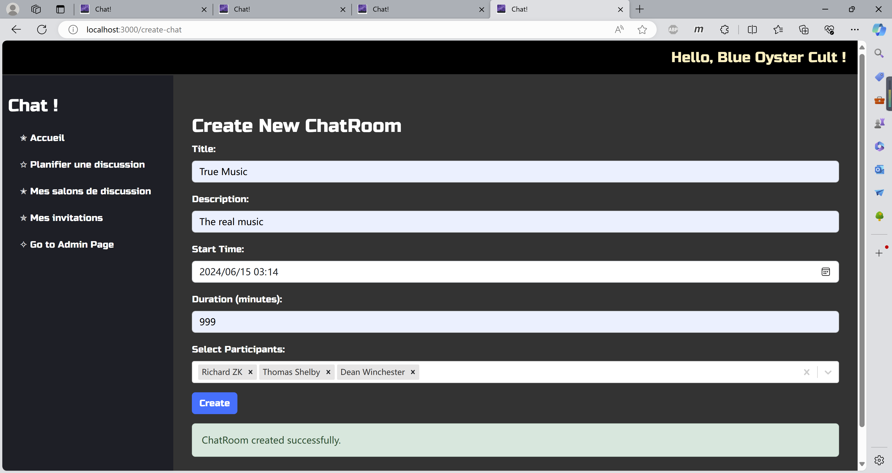

### Gestion du Chat
* Si un utilisateur est un participant d'un Chat Room, alors il a le droit de "voir" (View) tous les utilisateurs de ce Chat Room.
* Si cet utilisateur est le créateur d'un Chat Room, alors il peut "voir" (View), ajouter (Add) et supprimer (Remove) les utilisateurs de ce Chat Room; voire, supprimer (Delete) le Chat Room.

    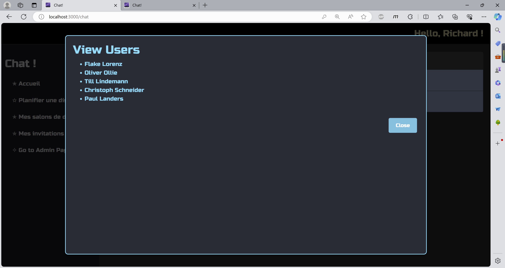
    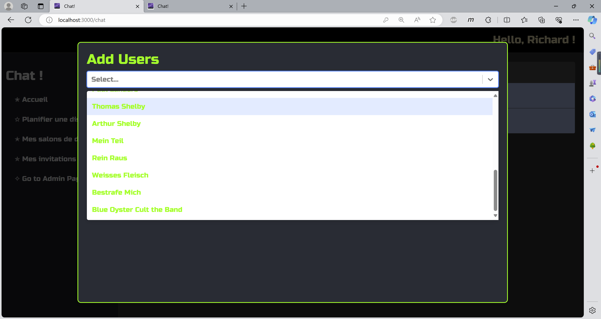
    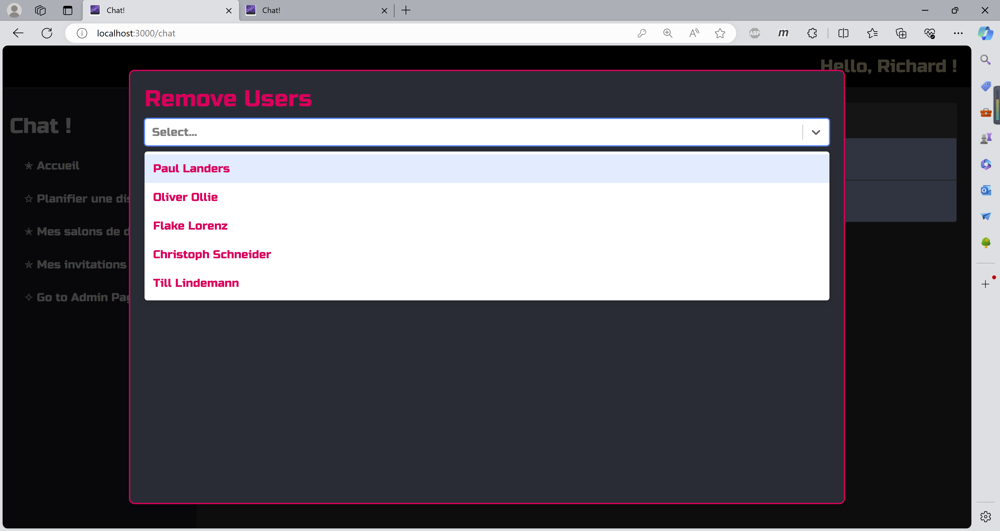

Si le créateur de la salle de chat souhaite la supprimer, il peut cliquer sur le bouton `Delete ChatRoom`,
puis une boîte de confirmation apparaîtra, comme le montre l'image ci-dessous.
Si vous cliquez sur "Yes", la salle de chat sera supprimée, sinon, la salle de chat ne sera pas supprimée.

    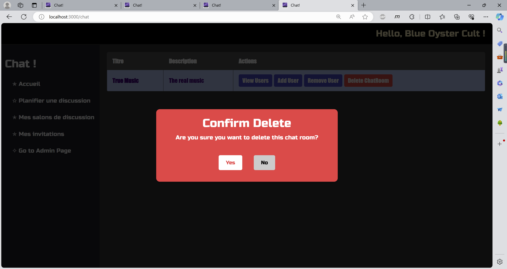

### Gestion des utilisateurs (Admin)

Pour les utilisateurs ayant le rôle d'administrateur, ils peuvent accéder à la page d'administration en cliquant sur le lien "Go to Admin Page" dans la page d'accueil.

Après avoir cliqué sur le lien, pour des raisons de sécurité, nous avons décidé qu'il faut d'abord se connecter en tant qu'administrateur pour accéder à la page d'administration.

    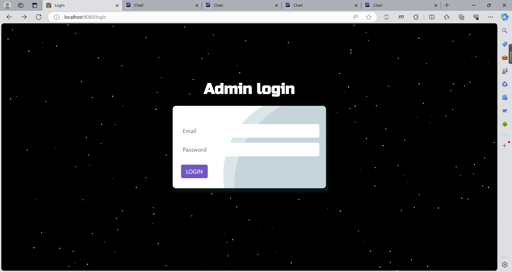

Après avoir entré le bon e-mail et le bon mot de passe, vous serez redirigé vers une page d'accueil simple pour les administrateurs comme illustré ci-dessous.

    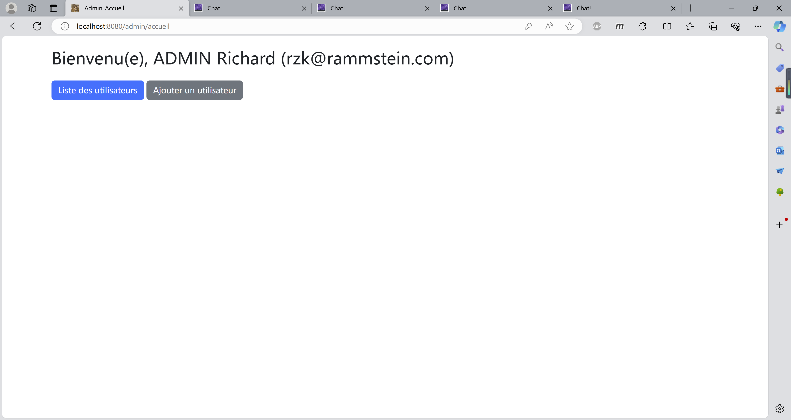

#### Ajouter un utilisateur

En cliquant sur le button `Ajouter un utilisateur`, vous allez rediriger vers une page pour ajouter un nouvel utilisateur.
Lorsqu'un utilisateur est ajouté avec succès, un message de succès s'affiche.

    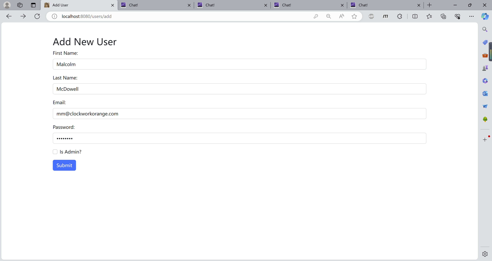
    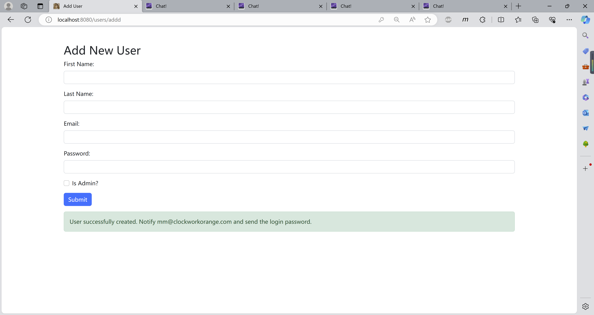

#### Liste des utilisateurs

En cliquant sur le button `Liste des utilisateurs`, vous pouvez voir la liste des utilisateurs enregistrés dans la base de données.

    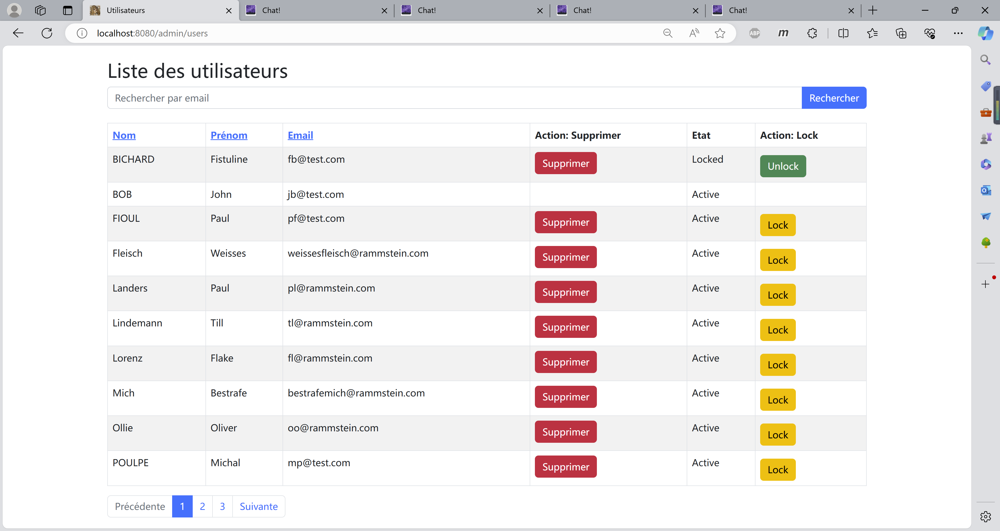

Nous affichons les informations de tous les utilisateurs dans l'ensemble de données :
* Nom (cliquez pour trier par ordre alphabétique ; tri par défaut sur la colonne Nom)
* Prénom (cliquez pour trier par ordre alphabétique)
* Email (cliquez pour trier par ordre alphabétique)
* Etat (si l'utilisateur est verrouillé ou non)

Nous pouvons également utiliser la barre de recherche pour retrouver rapidement un utilisateur, le mot-clé étant l'email de l'utilisateur.

Pour un utilisateur non-admin, nous pouvons effectuer les actions suivantes :
* Supprimer
* Verrouiller / Déverrouiller

Lors de la suppression d'un utilisateur, comme le montre l'image ci-dessous, nous devons d'abord confirmer si nous voulons vraiment supprimer cet utilisateur.

    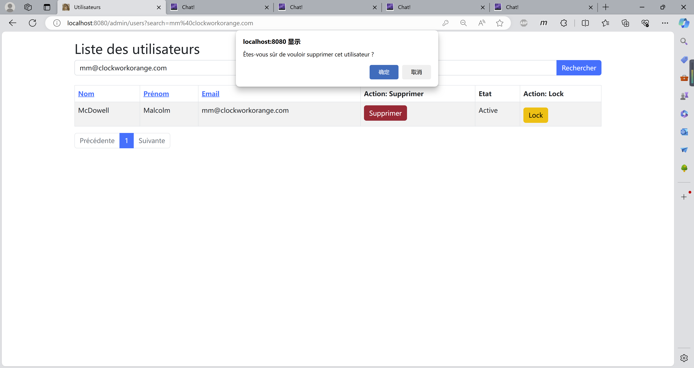

